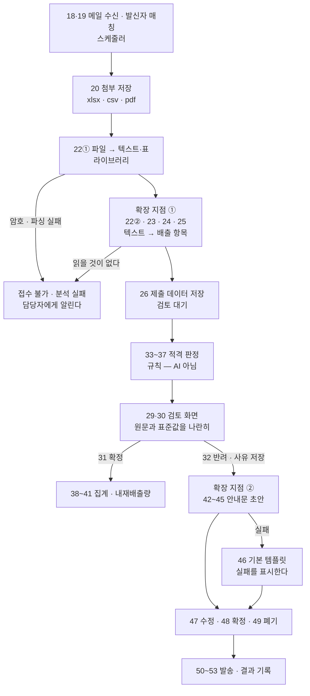

# AI 확장 지점

**이 서비스가 AI 를 부르는 자리는 두 곳이다.** 어디에 넣는지보다 **어디에 안 넣는지**가 더 중요해서, 그것을 함께 적는다.

| | |
| --- | --- |
| 규격 | [ADR-0010](../decisions/0010-ai-response-json-schema.md) |
| 프롬프트 | [`prompts/01-extraction.md`](prompts/01-extraction.md) · [`prompts/02-feedback-draft.md`](prompts/02-feedback-draft.md) |
| 스키마 | [`prompts/schema/`](prompts/schema/) |
| 검사 | `cd frontend && npm run ai:verify` |

---

## 「시스템(AI) 12개」와 「확장 지점 2곳」

[REQUIREMENTS](REQUIREMENTS.md) 는 대상이 **시스템(AI)** 인 기능을 12개로 센다. 화면(랜딩)은 **AI 확장 지점 2곳**이라 말한다. 둘 다 맞고 세는 단위가 다르다.

| 번호 | 기능 | LLM 을 부르나 |
| --- | --- | --- |
| **22 · 23 · 24 · 25** | 메일 분석 · 항목 추출 · 단위 표준화 · 부품 매핑 | **부른다 — 확장 지점 ①** |
| 26 · 27 | 분석 결과 저장 · 미등록 부품 조회 | 아니다. ①의 결과를 저장하고 보여주는 일 |
| 33 · 34 · 35 · 36 · 37 | 필수 검증 · 평균값 비교 · 변동 검사 · 상태 부여 · 사유 기록 | **아니다 — 규칙이다** (아래 참고) |
| 46 | AI 실패 처리 | 아니다. ②가 실패했을 때의 대비 |
| **42 · 43 · 44 · 45** | 초안 생성 · 일괄 · 문체 · 재생성 | **부른다 — 확장 지점 ②** |

**12개는 「AI 가 관여하는 기능」이고, 2곳은 「모델을 호출하는 자리」다.**

---

## 흐름 위의 어디인가



두 지점 모두 **사람이 확인한 뒤에야 다음으로 넘어간다.** ①의 결과는 검토 화면에서 원문과 나란히 놓이고, ②의 결과는 담당자가 고쳐서 확정한다. **AI 가 낸 것이 사람을 거치지 않고 밖으로 나가는 길이 없다.**

---

## 확장 지점 ① — 자료 추출 (UC-05)

| | |
| --- | --- |
| 부르는 때 | 20번 첨부 저장이 끝나면 **자동으로** (담당자가 누르는 버튼이 없다) |
| 입력 | 메일 본문 · 첨부에서 뽑은 텍스트 · **등록 부품 목록** |
| 출력 | [`extraction.schema.json`](prompts/schema/extraction.schema.json) |
| 화면 | 자료 변환(`ParseView`) · 검토 확정(`ReviewConfirmView`) |
| 비동기 | 202 + `taskId` → `GET /tasks/{taskId}` 폴링 (FE 가 이미 그 계약으로 돈다) |

**등록 부품 목록을 매번 입력에 넣는다.** 안 넣으면 모델이 그럴듯한 부품명을 지어내고, 25번의 「미등록 부품」이 한 번도 안 나온다 — 담당자는 매칭이 잘 됐다고 믿게 된다.

## 확장 지점 ② — 피드백 초안 (UC-10)

| | |
| --- | --- |
| 부르는 때 | 담당자가 초안 생성을 누를 때 (42번) 또는 일괄(43번) |
| 입력 | 판정 사유(37번) · 확인되지 않은 항목 · 미등록 부품 · 반려 사유(32번) · 문체 · 추가 지시 |
| 출력 | [`draft.schema.json`](prompts/schema/draft.schema.json) |
| 화면 | 초안(`FeedbackDraftView`) — 왼쪽 근거, 오른쪽 문안 |
| 실패 | 46번 — 기본 템플릿을 대신 주고 **실패했다고 화면에 말한다** |

---

## AI 를 넣지 않는 곳 — 33 ~ 37번 적격 판정

명세는 이 다섯을 시스템(AI)으로 분류하지만 **LLM 을 쓰지 않는다.**

| 규칙 | 하는 일 | 왜 AI 가 아닌가 |
| --- | --- | --- |
| R2 (33번) | 부품·생산량·직접배출량이 비었나 | `value === null` 인지 보는 일 |
| R4 (34번) | 평균값 ± 30% 초과인가 | 나눗셈 하나 ([ADR-0001](../decisions/0001-outlier-threshold.md)) |
| R7 (35번) | 직전 마감 대비 50% 이상 변동인가 | 나눗셈 하나 |
| R5 (24번) | 단위를 변환하지 못했나 | ①이 `unit: null` 로 이미 말했다 |
| R6 (25번) | 등록 부품과 매칭되지 않았나 | ①이 `matchedPartId: null` 로 이미 말했다 |

**규제 신고에 쓰이는 판정이다.** 같은 자료를 두 번 넣으면 같은 판정이 나와야 하고, 「왜 부적격인가」에 「모델이 그렇게 봤다」고 답할 수 없다. 37번이 「적용 규칙·비교 값·근거를 항목별로 저장」하라고 한 것이 그 뜻이다 — **근거는 재현되는 계산이어야 한다.**

그래서 [`extraction.schema.json`](prompts/schema/extraction.schema.json) 에는 `judgement` · `severity` · `rule` 필드가 **없다.** 스키마에 그 자리가 없다는 것이 이 결정의 표현이다.

> 하나 예외가 R3 「스캔 품질 미달」이다. 이건 계산으로 못 정하고 「텍스트가 거의 안 나왔다」는 판단이라 ①이 `status: "ANALYSIS_FAILED"`, `failure.code: "SCAN_QUALITY"` 로 말한다. 판정이 아니라 **읽기의 실패**다.

---

## 기존 웹 구조와 어떻게 맞물리나

**변환 계층을 새로 만들지 않았다.** 모델 출력에서 화면 행까지 함수 하나를 지난다.

```
OpenAI 구조화 출력
   → extraction.schema.json 대로의 JSON
   → frontend/src/api/ai.js · rowsFromExtraction()
   → { field, raw, value, unit, note, tone, where }
   → RawStdPair.vue 가 그린다 (명세 30번 「표준화 값과 원본 값을 나란히」)
```

| 이미 있는 것 | 무엇 |
| --- | --- |
| `api/client.js` 의 `request(endpoint, mock, real)` | 목/실서버 경계. AI 가 붙어도 화면 코드가 안 바뀐다 |
| `startTask` · `GET /tasks/{taskId}` | 202 + 폴링. ①이 오래 걸리는 것을 이미 전제한다 |
| `latestAnalysisTaskId` | 상세 응답이 진행 중인 작업을 가리킨다 |
| `analysisFailed` · `failure` | 22번 실패가 들어갈 자리 |
| `TEMPLATE_BODY` | 46번 기본 템플릿 |

`npm run ai:verify` 가 이 맞물림을 센다 — 예시 응답을 변환 함수에 통과시켜 **화면이 읽는 키가 전부 나오는지**, `tone` 이 규칙대로 정해지는지, 초안이 **근거 밖 항목을 요구하지 않는지** 확인한다.

---

## 🔴 키는 브라우저에 두지 않는다

`VITE_` 로 시작하는 환경변수는 **번들에 그대로 박혀** 브라우저 개발자도구에서 보인다. OpenAI 호출은 반드시 **백엔드(`AiService`)를 거친다.**

- 키는 `.env` 에만. 저장소에는 `.env.example` 의 빈 자리만 (루트 `.gitignore` 가 `.env` 를 이미 막고 있다)
- FE 는 `POST /submissions/{id}` · `POST /feedback-drafts` 같은 **자기 API 만** 부른다. OpenAI 를 직접 부르지 않는다
- 수업에서 받은 키라면 **사용량 한도**를 확인해 둔다. ①은 첨부 텍스트를 통째로 넣어 토큰이 많이 든다

---

## 아직 정해지지 않은 것

명세가 미결로 둔 것이라 **채우지 않았다.**

- **43번 일괄 초안 프롬프트** — 「AI 프롬프트로 생성 예정」. 지금은 건별 프롬프트를 여러 번 부른다. 근거가 건마다 다른데 한 응답에 섞으면 어느 문장이 어느 근거에서 나왔는지 확인할 수 없어서다
- **조치 3종** (`AI 작성 안내문` · `AI 재요청문` · `AI 확인 요청문`) — R1~R7 표에는 있는데 기능 표에 없다. 44번의 문체(격식·간결·친근)와 **다른 축**인데 관계가 정의돼 있지 않다. R 코드가 조치를 정하고 그 위에 문체가 얹히는 구조인지 팀이 정해야 한다
- **모델 id 와 요금제** — 키는 생겼지만 어느 모델을 쓸지, 토큰 한도를 어떻게 둘지 정하지 않았다
